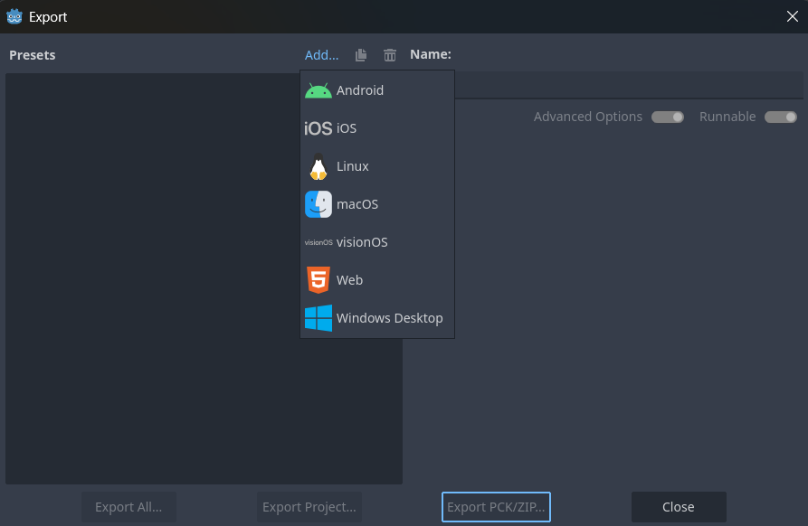
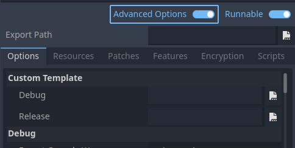

# Export Project

## Download Export Templates

First, download the template files for your target operating system:

## Configure Export Settings

1. In the Godot editor, go to **Project → Export...**
2. Click **Add** to add a new export preset
3. Select your target operating system from the list

4. Check the **Advanced Options** checkbox

5. Set the template paths:
   - **Release Template**: Path to the release template file you downloaded
   - **Debug Template**: Path to the debug template file you downloaded
Your project is now ready to export for the selected platform.