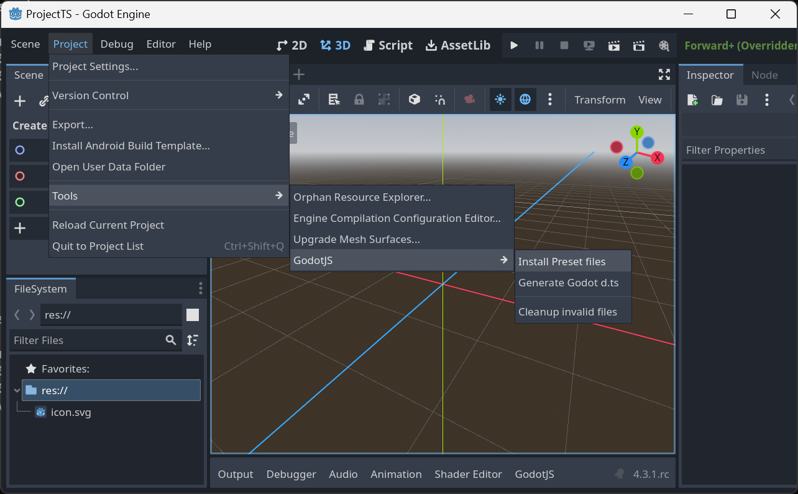
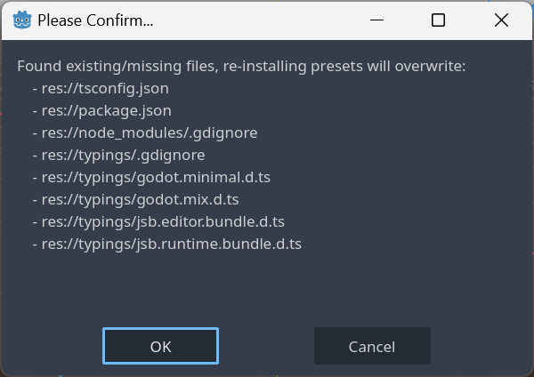
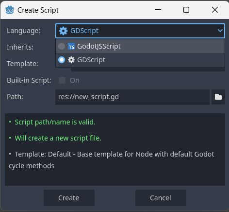
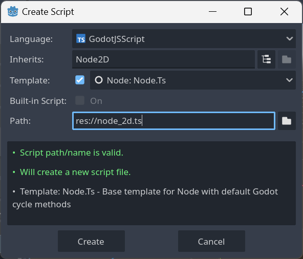
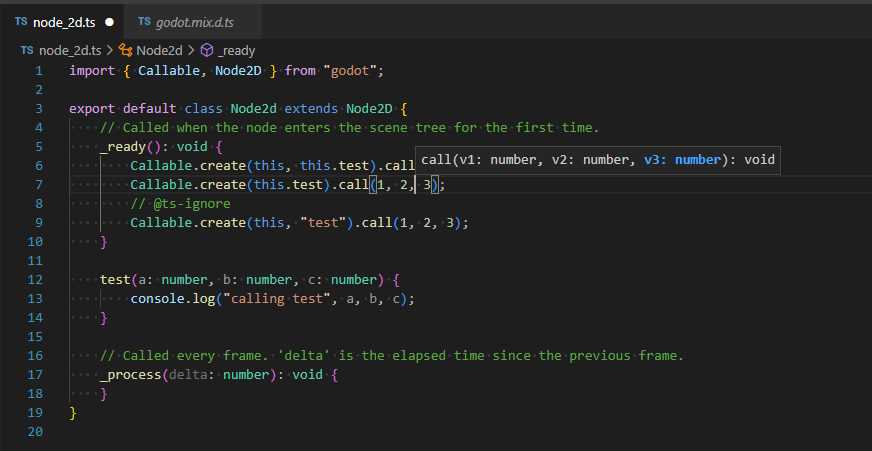
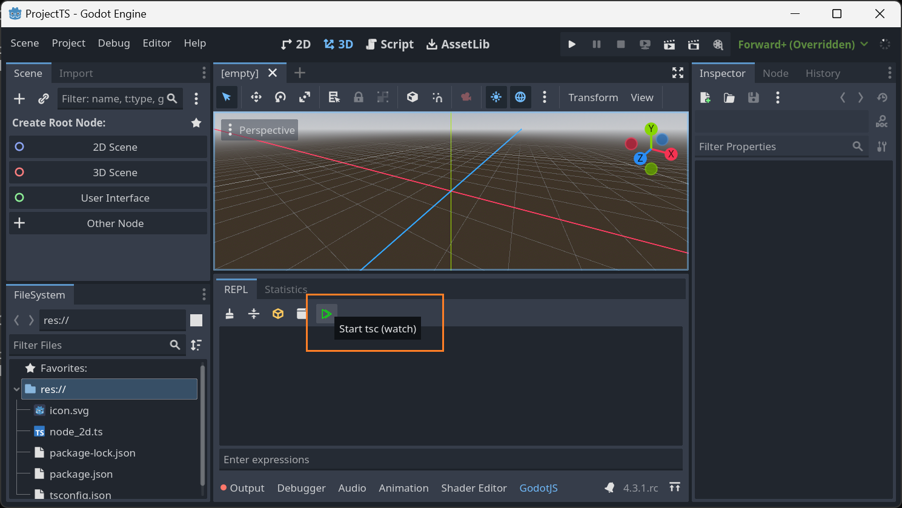

## Download GodotJS
Choose your platform and preferences to download the latest GodotJS release:

<div id="release-selector"></div>


> **Note:** The `Godot.app` isn't signed for MacOS you need
> to [allow to open it](https://support.apple.com/en-us/102445#:~:text=If%20you%20want%20to%20open%20an%20app%20that%20hasn%E2%80%99t%20been%20notarized%20or%20is%20from%20an%20unidentified%20developer).


### Manual Installation

If you prefer to browse all releases manually, visit the [GitHub Releases page](https://github.com/godotjs/GodotJS/releases).

### Installation Instructions

After downloading:

1. Extract the downloaded zip file
2. Rename the executable based on your OS:
    - **Linux**: `godot.linuxbsd.editor.x86_64` → `godot`
    - **macOS**: No rename required
    - **Windows**: `godot.windows.editor.x86_64.exe` → `godot.exe`
3. [Add Godot to your PATH](https://docs.godotengine.org/en/stable/tutorials/editor/command_line_tutorial.html#path)
4. Test the installation by running `godot --version` in your terminal

### JS Engine Comparison

| Engine             | Performance | Memory Usage | Platform Support | Recommended For          |
|--------------------|-------------|--------------|------------------|--------------------------|
| **V8**             | High | Higher | Desktop          | Development & Production |
| **QuickJS**        | Medium | Lower | All platforms    | Mobile & Embedded        |
| **JavaScriptCore** | High | Medium | macOS/iOS        | Apple platforms          |
| **Browser**        | High | Lower | Web              | Web                      |

### Target Types

- **Editor**: Full Godot editor with GodotJS support
- **Template**: Export templates for building your games
- **Debug**: Debug versions with additional logging and debugging features

## Create a new project

### Automatically with [godot-ts](https://github.com/godotjs/godot-ts)

1. Run `npx -y @godot-js/godot-ts init` (new project will be crated at your current terminal path)
2. Follow the prompts
3. Run `cd <your-project>`
4. Run `npm i`
5. Run `npm run dev` - this will enable typescript watch mode and opens the editor
6. Inside the editor [install preset files](#install-preset-files) via
   `Project > Tools > GodotJS > Install Preset files`
7. Click `OK` to confirm a list of files will be generated in the project.
8. Attach the `example.ts` script to a node and run the project

### Manually

1. Run `godot -p` and create a new project
2. Inside the editor [install preset files](#install-preset-files) via
   `Project > Tools > GodotJS > Install Preset files`
3. Click `OK` to confirm a list of files will be generated in the project.
4. Run `cd <your-project>`
5. Run `npm i`
6. Run `npx tsc` to compile the typescript files

### Install Preset Files





## Create Scripts

To create new scripts, press select GodotJSScript as language:



Use the `Node: Node.Ts` template:



Open the project folder in you IDE, you should see full TypeScript support!



## Compile TypeScript Sources without [godot-ts](https://github.com/godotjs/godot-ts)

Before your scripts runnable in _Godot_, run `tsc` to compile typescript sources into javascript.

```sh
npx tsc

# or watch if you want
npx tsc -w
```

Also, you can simply click the tool button on _GodotJS_ bottom panel in the godot editor. It'll do the same thing for
you.


