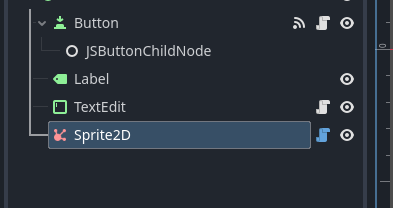
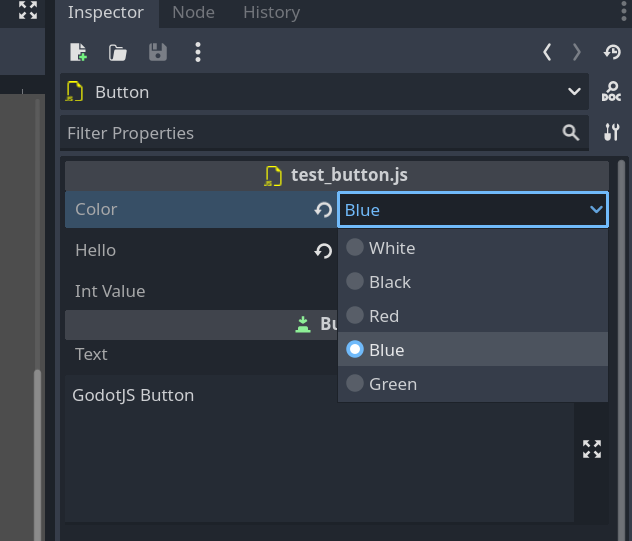

# Annotations

There are several annotations to help you define properties, signals, and other metadata for Godot objects.

All annotations are accessed through the `createClassBinder` function:

```ts
import { createClassBinder } from "godot.annotations";

const bind = createClassBinder();
```

## Signal annotation

You can define signals in your script using the `@bind.signal()` decorator:

```ts
import { Node, Signal } from "godot";
import { createClassBinder } from "godot.annotations";

const bind = createClassBinder();

@bind()
export default class MyJSNode extends Node {
  @bind.signal()
  accessor test!: Signal<(param1: string) => void>;
}
```

For more information about signals, check this [link](signals.md).

## Tool annotation

If a GodotJS class is annotated with `@bind.tool()`, it'll be instantiated in the editor.

```ts
import { Node } from "godot";
import { createClassBinder } from "godot.annotations";

const bind = createClassBinder();

@bind()
@bind.tool()
export default class MyTool extends Node {
  _ready() {
    // This code will run in the editor
    console.log("MyTool is running in the editor");
  }
}
```

For more information about running code in editor, check this [link](code-in-editor.md).

## Icon annotation

An icon can be used as node icon in the editor scene hierarchy with the annotation `@bind.icon()`.

```ts
import { Sprite2D } from "godot";
import { createClassBinder } from "godot.annotations";

const bind = createClassBinder();

@bind()
@bind.icon("res://icon/affiliate.svg")
export default class MySprite extends Sprite2D {}
```



## Export Annotation

In `GodotJS`, class member properties/variables can be exported.
This means their value gets saved along with the resource
(such as the scene) they're attached to.
They will also be available for editing in the property editor.
Exporting is done by using the `@bind.export()` decorator.

```ts
import { Variant } from "godot";
import { createClassBinder } from "godot.annotations";

const bind = createClassBinder();

@bind()
export default class Shooter extends Sprite2D {
  @bind.export(Variant.Type.TYPE_FLOAT)
  accessor speed: number = 0;

  // ...
}
```

In this example the value `0` will be saved and visible in the property editor.

The retrieval of default value is implemented through `Class Default Object (CDO)`.
`GodotJS` will instantiate a pure javascript instance of the script class
(`Shooter` in this example) as `CDO`, then the property value is read from
`CDO` as `default value` in the property editor.

> **NOTE:** Be cautious when coding within `constructor`, as it is probably called for initializing `CDO`.

### Basic Use

```ts
@bind.export(Variant.Type.TYPE_STRING)
accessor address: string = "somewhere";

@bind.export(Variant.Type.TYPE_INT)
accessor age: number = 0;
```

If there's no default value, `default value` of the given type will be used (`0` in this case).

```ts
@bind.export(Variant.Type.TYPE_INT)
accessor age: number;
```

### Exported Enum Properties

Enum value properties can be exported with the built-in support in the property editor.

> **NOTE:** So far, only `int` is supported as enum value.

```ts
@bind.exportEnum(MyColor)
accessor color: MyColor = MyColor.White;
```

The value can be easily chosen from a dropdown list in the editor.



## Documentation comments

You can use [documentation comments](https://docs.godotengine.org/en/stable/tutorials/scripting/gdscript/gdscript_documentation_comments.html)
with custom GodotJS annotations:

- ``@bind.help("...")``
- ``@bind.experimental("...")``
- ``@bind.deprecated("...")``

```ts
import { Variant } from "godot";
import { createClassBinder } from "godot.annotations";

const bind = createClassBinder();

@bind()
@bind.help("This will be shown in the editor when creating a new node of this type.")
export default class TestNode extends Node {

    @bind.experimental("Alternative to [method TestNode.doNewStuff].")
    doNewStuff(){
        // ...
    }
    
    doStuff(){
        // ...
    }

    @bind.deprecated("Use [method TestNode.doNewStuff] instead.")
    doOldStuff(){
        // ...
    }
    
}
```