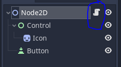
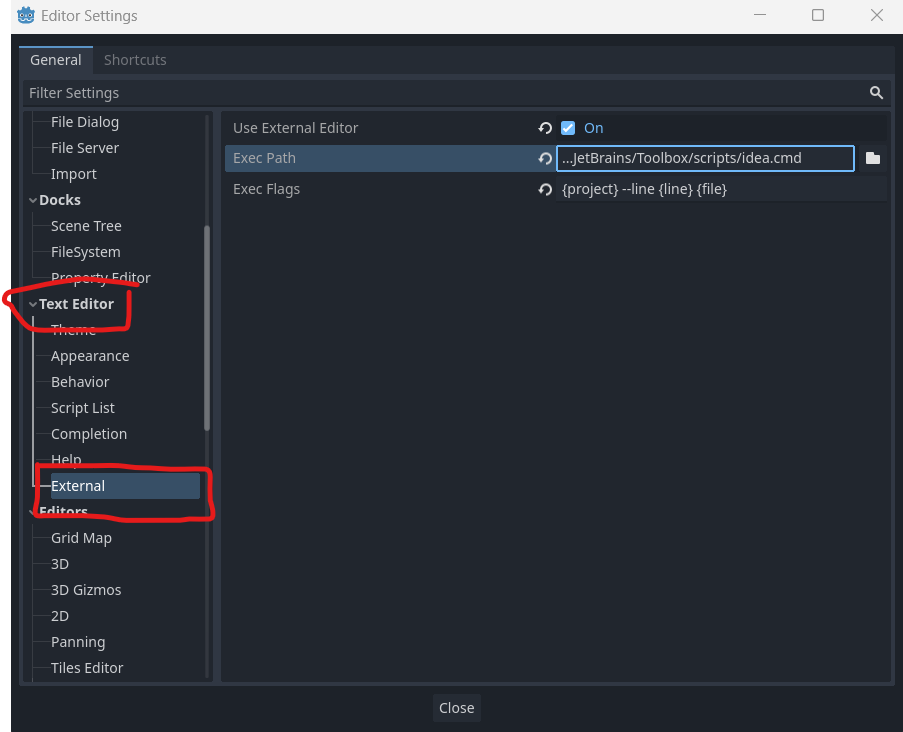

1. [Download the editor](https://github.com/godotjs/javascript/releases)
2. Rename the downloaded file to `godot` and [add Godot to your path](https://docs.godotengine.org/en/stable/tutorials/editor/command_line_tutorial.html#path)
3. Open a terminal
4. Test if you can use Godot via CLI and run `godot --version`
5. Run `npx -y @godot-js/godot-ts init` (new project will be crated at your current terminal path)
6. Follow the prompts
7. Run `cd <your-project>`
8. Run `npm i`
9. Run `npm run dev` - this will enable typescript watch mode and opens the editor
10. Run the menu command inside the editor `Project > Tools > JavaScript > Generate TypeScript Declaration File` and overwrite file `godot.d.ts`

## Features

- By running `npm run dev` you compile your `.ts` files into `.mjs` automatically
- Use the generated `.mjs` files inside your editor
- To open the `.ts` origin file for a `.mjs` file you need to enable [External Editor](#open-scripts-from-the-editor)
- If you want to start the game without editor run `npm run start`
- For more information check out [`godot-ts`](godot-ts.md)

## Open scripts from the editor

Inside the editor you are normally able to open a script inside the build in text editor.

But we use a compiled `.mjs` file for our scripts.
`.ts` files can't be open in the editor.

So we need to open the `.ts` files inside an external editor:

1. Goto `Editor/Editor Settings/Text Editor/External`
2. Check the `Use External Editor`
3. Add your path your desired editor to `Exec Path` - Check [this](https://docs.godotengine.org/en/stable/tutorials/editor/external_editor.html) for more information
4. Paste `{project} --line {line} {file}` (JetBrains products) to `Exec Flags`
5. If you click on a `.mjs` script it should read the `banner` on top of the file like `//generatedPath=<absolute-path>.ts` and opens this file

